# Laravel-Adam-CMS使用手册
##### TIPS：使用本 **CMS** 需要PHP & Laravel的操作经验
## 构建Laravel环境
 - 由于 **Laravel** 框架采用 **Composer** 管理项目，所以会本文介绍 **CentOS** 下安装 **Composer** ；
 1. 获取 **Composer** 镜像：
`curl -sS https://getcomposer.org/installer | php`
 2. 配置 **Composer** 到 **usr/local/bin** 目录:
`mv composer.phar /usr/local/bin/composer`
 3. 授权 **Composer** 为可执行文件:
`chmod+x /usr/local/bin/composer`
## 部署代码
  - 将项目目录打包上传至服务器空间；本文采用 **Nginx** 驱动PHP脚本，配置方案如下所示(如果是 **Apache**，请自行查阅文献)；
```
# /www.example.com.conf

server
{
    listen 80;
    server_name www.example.com;
	index index.php;
    root /www/wwwroot/www.example.com/public;
    
    # SSL-START SSL相关配置，请勿删除或修改下一行带注释的404规则
    #error_page 404/404.html;
    #SSL-END
    
    # ERROR-PAGE-START  错误页配置，可以注释、删除或修改
    error_page 404 /404.html;
    error_page 502 /502.html;
    #ERROR-PAGE-END
    
    # PHP-INFO-START  PHP引用配置，可以注释或修改
    include enable-php-71.conf;
    #PHP-INFO-END
    
    # REWRITE-START URL重写规则引用,修改后将导致面板设置的伪静态规则失效
    include /www/server/panel/vhost/rewrite/site.hbwmpt.com.conf;
    #REWRITE-END

    # 启用PHP-FPM
    location / {
        try_files $uri $uri/ /index.php$is_args$args;
    }

    location ~ \.php {
        try_files $uri = 404;
        fastcgi_split_path_info ^(.+\.php)(/.+)$;
        include fastcgi_params;
        fastcgi_param SCRIPT_FILENAME $document_root$fastcgi_script_name;
        fastcgi_param SCRIPT_NAME $fastcgi_script_name;
        fastcgi_index index.php;
        fastcgi_pass 127.0.0.1:9000;
    }

    # 禁止访问的文件或目录
    location ~ ^/(\.user.ini|\.htaccess|\.git|\.project|LICENSE|README.md)
    {
        return 404;
    }
    
    location ~ .*\.(gif|jpg|jpeg|png|bmp|swf)$
    {
        expires      30d;
        access_log off; 
    }
    
    location ~ .*\.(js|css)?$
    {
        expires      12h;
        access_log off; 
    }
    access_log  /www/wwwlogs/site.hbwmpt.com.log;
}
```
## 数据初始化
1. 执行 `php artisan migrate` 建立数据库表
2. 本文使用 **MySQL** 作为数据库，可以使用项目目录下 '**SQL**' 文件夹中的 '**cms.sql**' 还原初始化的数据；如果服务器系统是 **CentOS** ，可以简单的通过 `yum install -y phpmyadmin` 来安装 **PhpMyAdmin**管理数据库。

## CMS前台
 - 初始化数据以后，可以在浏览器中输入 **Nginx** 配置文件中设置过的 '**server_name**'，即可看到如下所示的 **CMS** 前台页面；


## CMS后台
 - 由于本 **CMS** 并没有涉及到子域名路由，只是简单添加了一个 '**/admin**' 路由组，所以只需要在浏览器中输入'**server_name**'加上 '**/admin**' 即可进入CMS后台的登录页；

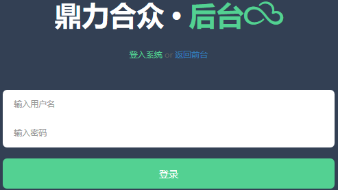
 - 如果是通过上述 '**cms.sql**' 初始化数据库数据，那么就会默认生成一个 **超级管理员（superman）** 和一个 **普通管理员（testman）**，其初始密码都是 **123456**；保证登录信息输入正确之后，即可进入后台管理页面；

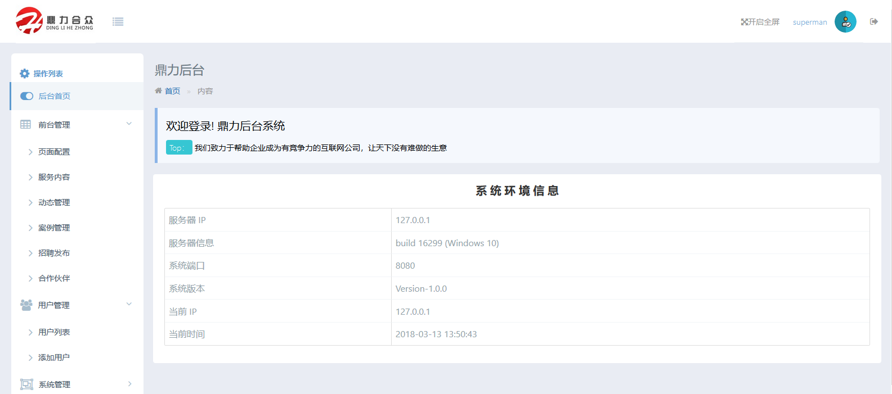
 - 本 **CMS** 可以对前台页面内容进行基本的管理操作，具体有以下功能：
 1. 配置前台页面的主要内容，包括每个页面的 '**置顶图片**'、'**置顶标题**'、'**置顶描述内容**'；

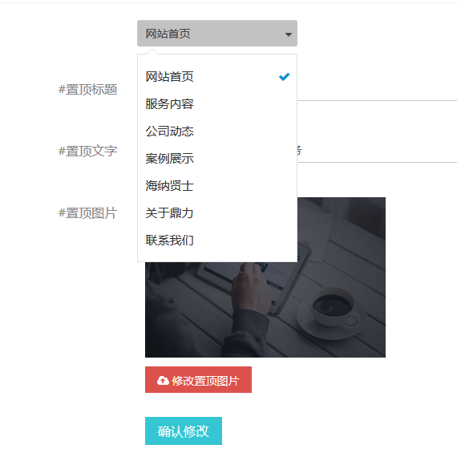
 2. 对 '**服务内容**' 相关信息的添加、删除及更新；

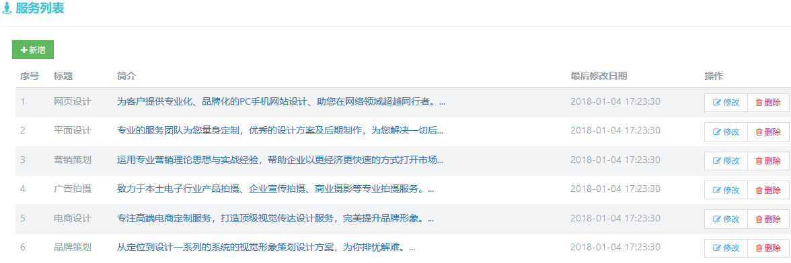
 3. 添加、删除、更新 '**最新动态**' 的内容；


 4. 添加、删除、更新 '**优秀案例**' 的内容；

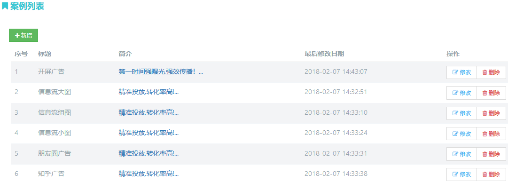
 5. 添加、删除、更新 '**招聘信息**' 的内容；

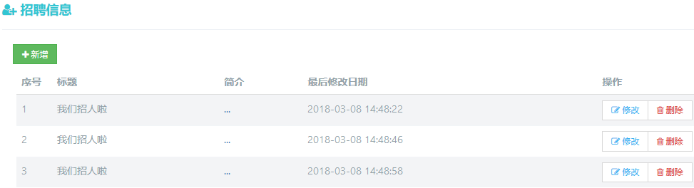
 6. 对 '**合作伙伴**' 的添加、删除及更新；

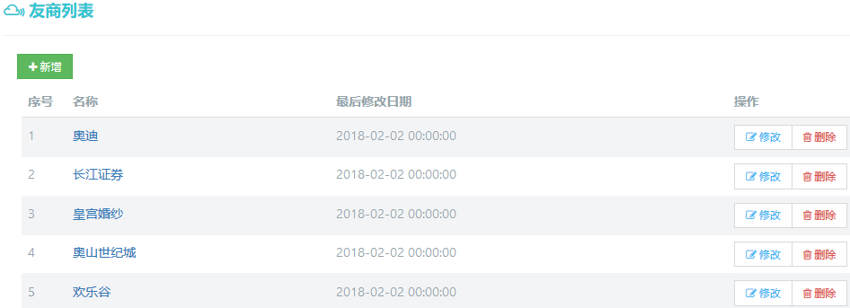
 - 当然，如果使用 **超级管理员（superman）** 登录后台，就可以对子管理员进行添加、删除、更新；

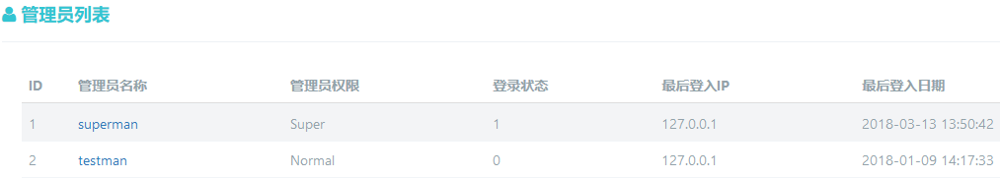

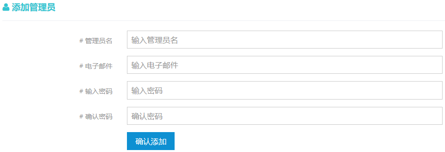
 - 为了能够更好地分析 **CMS** 前台网站的使用情况以及访问流量，在 **CMS** 后台中还包含后台的 '**操作日志**' 以及网站访问数据的 '**统计图表**'（一周的统计情况）；

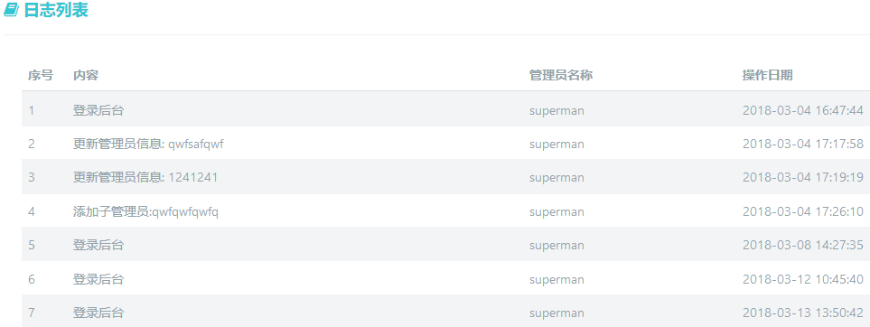

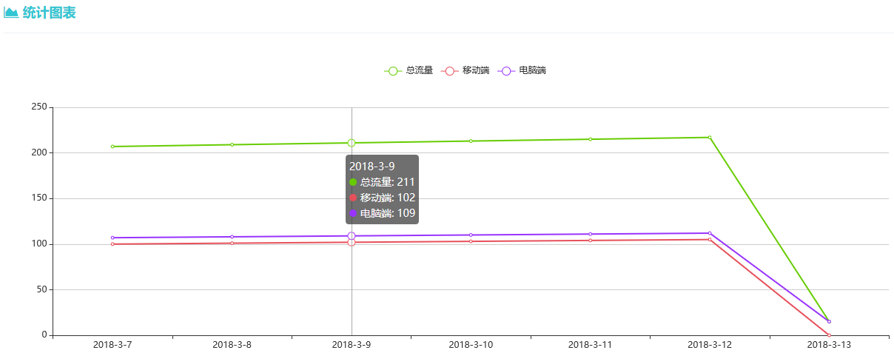
## 优化 & 改进
 - 由于 **Laravel** 框架严密的封装性和高内聚架构，其Web性能一直为人所诟病，但是本 **CMS** 只是作为官网的管理系统，对于整体的性能要求较低，只要访问者开启了浏览器的 **Cookie** 之后，体验也是能够接受；
 - 整个 **CMS** 前端采用了 **Amaze UI** 的模板，很大程度上限制了页面的可修改性，在之后的更新将会对前端模板的样式进行仔细分解，保证 **CMS** 前台页面的每一处都可以动态修改；